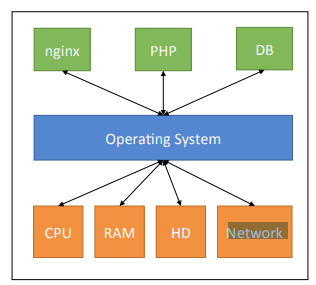
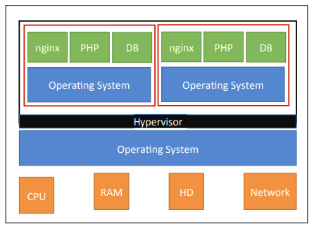
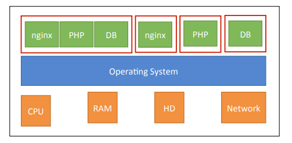

# Docker

## Normal Bare-Metal Server 


## Virtual Machines


## Containers


## Getting Started

### docker run
#### will	run	a	container	
#### This	will	not	restart	an	exisVng	container,	just	create	a	new	one

```
docker	run	[opVons]	IMAGE	[command]	[arguments]	
```
#### [opVons	]modify	the	docker	process	for	this	container	
• IMAGE	is	the	image	to	use	
• [command]	is	the	command	to	run	inside	the	container	
• [arguments]	are	arguments	for	the	command	